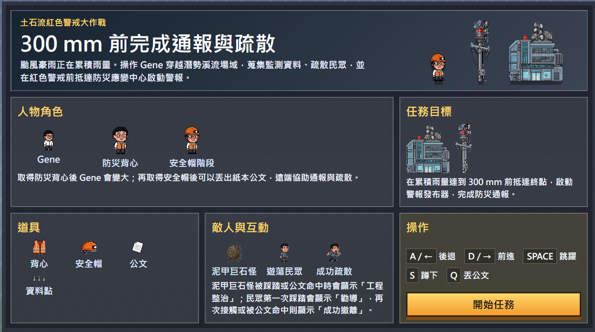

# 土石流紅色警戒大作戰

> 以橫向卷軸平台遊戲包裝土石流防災教育的互動原型。  
> 玩家將操作 **Gene** 穿越潛勢溪流場域，在累積雨量達到 **300 mm** 前，完成監測、疏散與通報任務，最後抵達防災應變中心啟動警報。

---

## 專案亮點

- 將平台遊戲玩法轉化為 **土石流防災教育情境**
- 以 **累積雨量** 取代傳統倒數時間，建立警戒壓力
- 將 **疏散民眾、蒐集監測資料、啟動通報** 做成實際可玩的遊戲機制
- 具備 **前導頁、遊戲 HUD、結算儀表板**
- 已整理成可獨立執行、可直接上傳 GitHub 的最小發布版

---

## 畫面預覽



---

## 最新版本更新

- **監測資料點有實際防災作用**：每收集 1 個資料點可降低 `6 mm` 累積雨量，讓蒐集行為不再只是加分。
- **雨量警戒會改變場域難度**：進入黃色警戒後，泥甲巨石怪與坍方節奏都會升級；逼近紅色警戒時再進一步加壓。
- **新增坍方警示機制**：特定區域會先出現警告牌，接著從空中落下落石，讓玩家必須辨識並快速通過危險帶。
- **前中後段道具節奏重新平衡**：防災背心維持前段取得，安全帽延後到中後段，讓關卡節奏更合理。

---

## 遊戲概念

颱風豪雨持續累積降雨，潛勢溪流所在區域逐步逼近土石流紅色警戒門檻。  
玩家扮演主角 **Gene**，進入高風險場域執行防災任務：

- 蒐集監測資料點
- 勸導並疏散民眾
- 處理場域中的泥石威脅
- 在紅色警戒前抵達終點
- 啟動警報發布器與防災應變中心

這不只是跑到終點的遊戲，而是把「防災應變流程」拆成玩家能看懂、能操作、能體會壓力的互動系統。

---

## 任務目標

### 主要任務

在 **累積雨量 300 mm** 前：

1. 穿越關卡
2. 蒐集監測資料
3. 協助民眾疏散
4. 抵達土石流防災應變中心
5. 啟動警報發布器，完成通報

### 失敗條件

- 掉入地形洞口
- 遭遇威脅後失敗
- 未在雨量達標前完成通報

---

## 角色設定

### Gene

玩家操作的主角，依取得道具會有三段狀態：

- **Gene 初始狀態**：白襯衫、黑褲的小型角色
- **防災背心狀態**：取得背心後角色變大
- **安全帽狀態**：取得安全帽後可投擲紙本公文

這三段狀態對應從進入場域、具備作業能力，到能遠端協助通報與撤離的進階過程。

---

## 道具系統

### 防災背心

- 對應平台遊戲中的基礎強化道具
- 取得後角色變大，提升行動狀態辨識

### 安全帽

- 對應進一步強化道具
- 取得後可丟出 **紙本公文**

### 紙本公文

- 可遠端命中目標
- 可直接讓民眾進入 **成功撤離**
- 可對泥甲巨石怪觸發 **工程整治**

### 監測資料點

- 散布於關卡中
- 收集後會記錄於 HUD 與結算頁統計
- 每收集 1 個可降低 `6 mm` 累積雨量，緩解紅色警戒壓力

---

## 敵人與互動對象

### 泥甲巨石怪

關卡中的基礎威脅單位，取代原本的蘑菇怪。

- 緩慢移動
- 具有壓迫感與地質災害象徵
- 被踩踏或被公文命中時，會顯示 **工程整治**

### 遊蕩民眾

代表尚未完成避難的居民，具有兩段式互動：

- **第一次踩踏**：顯示 **勸導**
- **再次接觸或公文命中**：顯示 **成功撤離**，並快速撤出畫面

這個設計把「勸導」與「實際撤離」拆成兩個可理解的階段。

---

## HUD 與防災儀表板

遊戲畫面左上與右上的 HUD 不只是分數，而是任務儀表板：

- **通報分數**
- **疏散民眾**
- **監測資料**
- **累積雨量：xx mm / 300 mm**
- **警戒狀態**
- **警戒升級提示**：黃色警戒與逼近紅色警戒時，會顯示場域升級狀態

### 結算頁

任務成功或失敗後，會進入 **戰情結算儀表板**，整理：

- 疏散成果
- 監測資料完成度
- 累積雨量
- 通報分數
- 防災教育摘要
- 任務結果判定

---

## 操作方式

| 按鍵 | 功能 |
|------|------|
| `A` / `←` | 後退 |
| `D` / `→` | 前進 |
| `SPACE` | 跳躍 |
| `S` | 蹲下 |
| `Q` | 丟公文 |

---

## 教育設計重點

本專案的核心不是單純換皮，而是用平台遊戲結構承載防災教育情境：

- **雨量門檻壓力**：讓玩家理解警戒值的時間壓迫感
- **疏散流程拆解**：從勸導到成功撤離
- **監測資料概念**：強化場域資訊蒐集的重要性
- **應變中心終點**：讓任務收束在正式通報與應變啟動
- **結算頁教育摘要**：把遊玩結果轉成可閱讀的宣導資訊

---

## 快速開始

### 方式一：Python

```bash
python -m http.server 8080
```

開啟：

[http://localhost:8080](http://localhost:8080)

### 方式二：Windows 批次檔

直接執行：

```bat
start-local-server.bat
```

---

## 部署到 GitHub Pages

這份發布版已整理成 **純靜態網站**，可以直接部署到 GitHub Pages。

### 建議的 GitHub Repo 名稱

GitHub repository 名稱不能用空白，建議改成：

```text
super-gene-red-alert-run
```

### 部署方式

1. 在 GitHub 建立新的 repository
2. 將這個資料夾內的內容推到該 repository 根目錄
3. 推送後進入 GitHub repository 的 `Settings` -> `Pages`
4. 在 `Build and deployment` 中選擇 **GitHub Actions**
5. 等待 Actions 跑完，Pages 就會自動發布

### 發布網址

如果 GitHub 帳號為 `yourname`，repository 名稱為 `super-gene-red-alert-run`，網址會是：

```text
https://yourname.github.io/super-gene-red-alert-run/
```

### 部署前注意

- 本專案所有資源路徑目前都是 **相對路徑**
- 已內建 `.nojekyll`
- 已附上 GitHub Pages workflow：`.github/workflows/deploy-pages.yml`
- 如果只是部署到 GitHub Pages，**不需要 Node build**

---

## 專案結構

```text
gene-landslide-red-alert/
├─ index.html
├─ README.md
├─ LICENSE
├─ start-local-server.bat
├─ assets/
│  ├─ blocks/
│  ├─ collectibles/
│  ├─ css/
│  ├─ custom/
│  ├─ entities/
│  ├─ fonts/
│  ├─ hud/
│  ├─ others/
│  ├─ scenery/
│  └─ sound/
├─ javascript/
│  ├─ game.js
│  ├─ game/
│  └─ helpers/
└─ vendor/
   ├─ phaser.min.js
   └─ rex/
```

---

## 這份發布版做了什麼整理

這個資料夾已針對 GitHub 發布用途做過精簡：

- 移除開發暫存資料夾與測試輸出
- 移除規劃用文件與中間產物
- 保留實際執行遊戲所需的程式與素材
- 內建 Phaser 與 Rex Plugins 本地依賴
- 保留目前的固定關卡、防災主題、前導頁與結算頁

---

## 技術基礎

- **Phaser 3**
- 原始專案基底來自：
  [pablogozalvez/Super-Mario-Phaser](https://github.com/pablogozalvez/Super-Mario-Phaser)

本發布版已在原始專案基礎上延伸為：

- 固定關卡模式
- 土石流防災主題化
- 自訂角色與敵人素材
- 防災任務 HUD
- 前導頁與結算儀表板

---

## 授權與致謝

原始遊戲程式基礎來自開源專案 `Super-Mario-Phaser`。  
本專案在其基礎上進行主題改造、關卡資料化、素材替換與教育化互動設計，作為防災教育原型使用。

音效補充說明：

- 遊戲內實際使用的短音效已替換為開源 CC0 資源，完整對照可見 `assets/sound/SOURCES.md`
- 主題曲 `assets/sound/music/custom/red-alert-sprint.mp3` 為以 Gemini 製作的原創音樂素材
